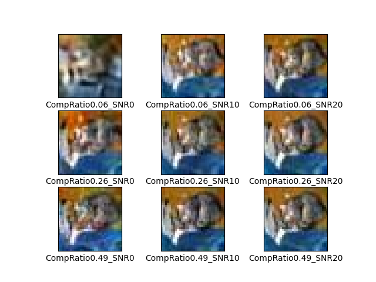

# Deep Joint Source-Channel Coding

    
## 모델 별 PSNR 비교  

## 모델 별 SSIM 비교

## model6 성능 평가 : 압축률에 따른 PSNR  

## model6 성능 평가 : k/n=0.49일 때 test SNR에 따른 PSNR  

## Image
- original

#### parameter
  - epochs = 5
  - batch size = 16  

#### Requirements
* python == 3.6
* tensorflow == 1.15.0
* keras == 2.3.1
* h5py == 2.10.0

