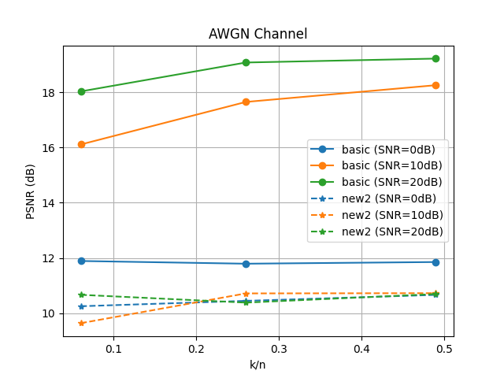

# Deep Joint Source-Channel Coding

    

- 성능 평가1 (압축률에 따른 PSNR)

- 성능 평가2 (k/n=0.06)

- 성능 평가2 (k/n=0.26) : not completed
- 성능 평가2 (k/n=0.49)  

#### parameter
  - epochs = 5
  - batch size = 16  

#### Requirements
* python == 3.6
* tensorflow == 1.15.0
* keras == 2.3.1
* h5py == 2.10.0

