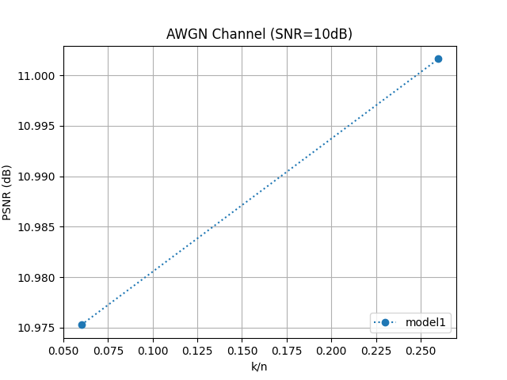
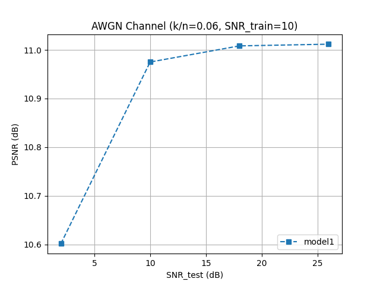

# Deep Joint Source-Channel Coding

###진행상황(21.11.13)
- model1 구조로 2개 모델 실행함
  - snr = 10
  - k/n = 0.06, 0.26
  - epochs = 5
  - batch size = 16  
    

- 성능 평가1 (압축률에 따른 PSNR)

- 성능 평가2 (SNR_train과 SNR_test에 따른 PSNR)

###향후 계획
- 기존 모델 실행
- 다른 구조 모델 실행해서 비교하기
- 학습 반복 수 늘리기
- 다른 잡음 채널에서 적용하기

#### Requirements
* python == 3.6
* tensorflow == 1.15.0
* keras == 2.3.1
* h5py == 2.10.0

