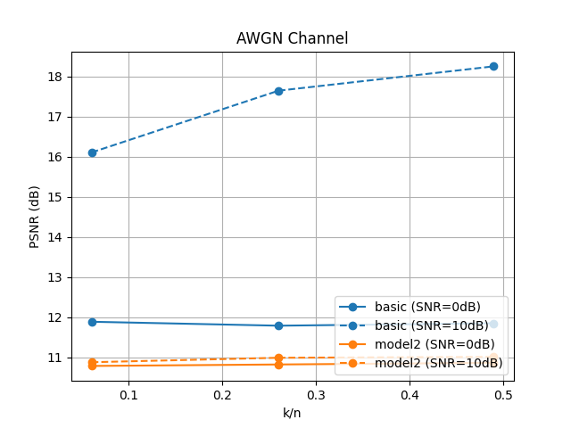

# Deep Joint Source-Channel Coding

#### 진행상황(21.11.15)
- model_CompRatio_SNR
  - basic(0.06, 0.26, 0.49)_(10, 20)
  - model1_(0.06, 0.26)_(10)
  - model2_(0.06, 0.26, 0.49)_(10)
  
- parameter
  - epochs = 5
  - batch size = 16  
    

- 성능 평가1 (압축률에 따른 PSNR) 

- 성능 평가2 (k/n=0.06)   

- 성능 평가2 (k/n=0.26)  

- 성능 평가2 (k/n=0.49)  

#### Requirements
* python == 3.6
* tensorflow == 1.15.0
* keras == 2.3.1
* h5py == 2.10.0

